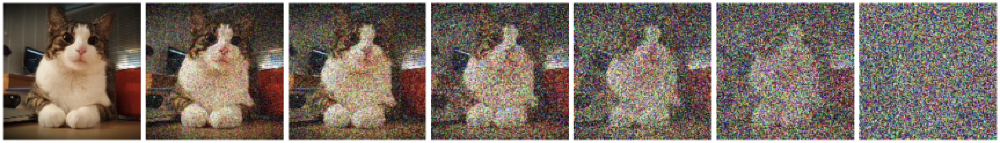

# **noisOut: Denoising Diffusion Probabilistic Models**

**noisOut** is a deep learning implementation based on Denoising Diffusion Probabilistic Models (DDPM) for generating high-quality images by training a model to reverse a diffusion process. This repository provides an implementation based on the work of **Dhariwal & Nichol (2021)** and **Ho et al. (2020)** to generate flowers from noise through a diffusion-based generative process.

<div>
  
</div>

## **Overview**

The **noisOut** model uses a **UNet architecture** with Sinusoidal Position Embeddings for temporal conditioning, as described in the work of **Ho et al., 2020**. It operates by learning to reverse the forward diffusion process that gradually adds noise to an image. The model is trained to recover the original image from noisy versions at various time steps. Once trained, it can generate new samples by reversing the noise process.

## **How It Works**

The model consists of two main components:
1. **Forward Diffusion Process**: Gradually corrupts the image with noise over time.
2. **Reverse Diffusion Process (Model)**: Trains to reverse this corruption by learning to predict the noise at each step, effectively reconstructing the original image.

### **Key Features**:
- **Forward Diffusion**: Adds Gaussian noise at each time step.
- **Reverse Diffusion (DDPM)**: The model learns to undo this noise and generate samples.
- **Sinusoidal Position Embeddings**: Used for encoding the time step information.

## **Dependencies**

To install the dependencies, you can use `pip`:

```bash
pip install -r requirements.txt
```

## **Usage**

### **1. Download the Dataset**:
The Flowers102 dataset is automatically downloaded when the code is executed. It is used as the example dataset for training the model.

### **2. Running the Notebook**:
After cloning this repository, you can run the `test.ipynb` notebook, which demonstrates how the model is built, trained, and how it generates new images from noise. It includes the following steps:
- Data preprocessing
- Model architecture construction
- Forward and reverse diffusion process
- Training loop
- Inference for sample generation

To start, open the `test.ipynb` file in a Jupyter notebook environment and run the cells.

### **3. Saving and Loading Models**:
The trained model is saved after training and can be loaded using `torch.load`. The model is saved in the `./models` directory.

```python
torch.save(model.state_dict(), './models/Flowers102_model.pth')
```

### **4. Inference**:
Once the model is trained, you can generate new images by running the `sample_image()` function. This function demonstrates the reverse diffusion process to generate samples from noise.

<div>
  
</div>

## **References**

1. **Dhariwal, P., & Nichol, A. (2021).** *Diffusion Models Beat GANs on Image Synthesis*.  [Link](https://arxiv.org/abs/2105.05233) <br>
In this paper, Dhariwal and Nichol explore the potential of Diffusion Models (DMs) as a generative model for high-quality image synthesis. They present a comparison of DMs with Generative Adversarial Networks (GANs), traditionally the dominant approach for image generation tasks. The authors argue that diffusion models, while slower during inference, offer several advantages over GANs, including more stable training and better generation quality.
2. **Ho, J., Jain, A., & Abbeel, P. (2020).** *Denoising Diffusion Probabilistic Models*.  [Link](https://arxiv.org/abs/2006.11239) <br>
In this paper, Ho et al. propose the Denoising Diffusion Probabilistic Model (DDPM), a novel framework for generative modeling that builds on the concept of a forward and reverse diffusion process. DDPMs are a type of diffusion model designed to iteratively add noise to data and then learn to reverse this process to recover the original data.

## **Conclusion**

In this project, we implemented a Denoising Diffusion Probabilistic Model (DDPM) for generating images using the Oxford-102 dataset. By leveraging a UNet architecture with Sinusoidal Position Embeddings, the model learns to reverse the forward diffusion process, effectively generating realistic images from noise.

The noisOut framework demonstrated the effectiveness of DDPMs in image synthesis, showing competitive performance with Generative Adversarial Networks (GANs). The notebook provides an easy-to-use implementation for training and inference. Future improvements could focus on optimizing training and exploring more complex datasets.

Overall, this project highlights the potential of diffusion models in generative modeling.